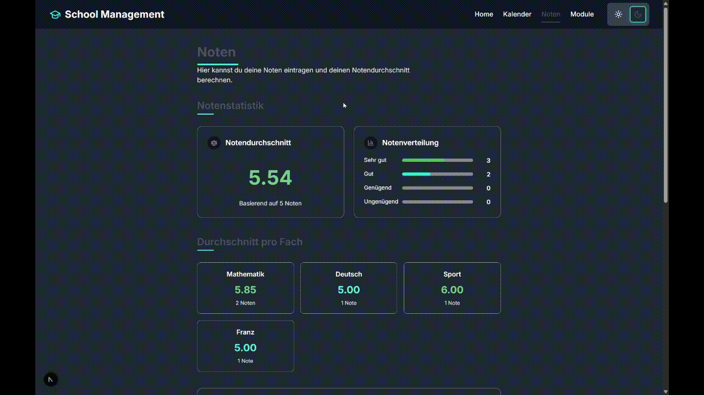
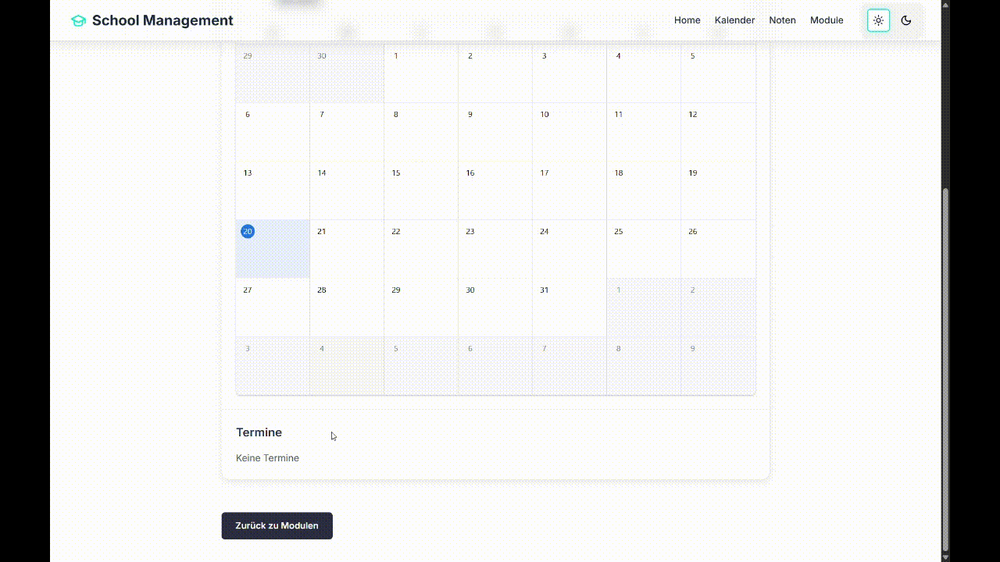
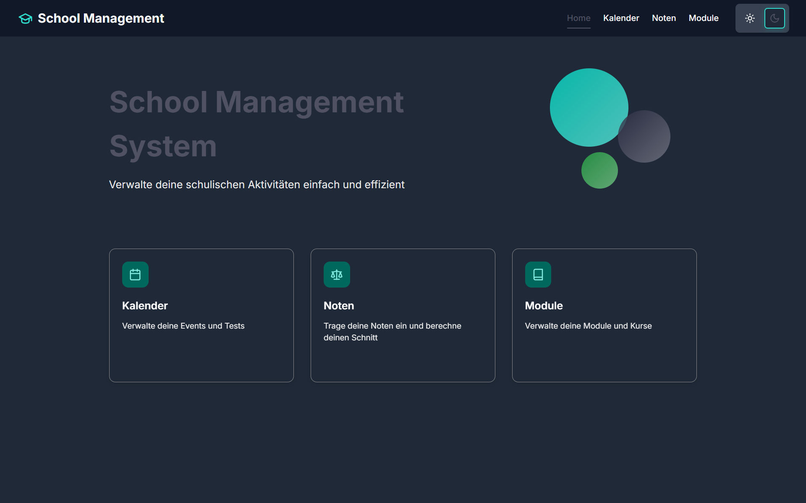

# School Management System (SMS)


**A modern web app to organise grades, modules, and school events. Simple and efficient.**

---

## 📊 Grades Page

- Add new grades with validation
- Calculate overall and subject-wise averages
- See grade breakdown: very good, good, sufficient, insufficient
- Delete grades with confirmation
- Persistent backend (MongoDB)



---

## 🗂️ Modules Page

- Manage school modules
- each module has a title and description
- Open a detail view to access related content
- Each module contains its own calendar


---

## 📅 Calendar Integration

- Add and view calendar entries inside module views
- Responsive and interactive calendar UI



---

## 🖱️ UI & Animations

- Smooth hover effects across all elements
- Subtle transitions between views and modals
- Designed with a strong focus on feel and responsiveness


---

## 🖥️ Homepage

- Title: **School Management System**
- Subtitle: *Manage your school activities easily and efficiently*
- Three feature cards: Grades, Modules, Calendar
- Each card includes hover animations and leads to the corresponding page



---

## 🎨 Design System

This app uses a clean and modern color theme, created with [HeroUI](https://www.heroui.com/themes), balancing clarity with contrast.

| Category           | Token        | HEX Value   | Description                                |
| ------------------ | ------------ | ----------- | ------------------------------------------ |
| **Default Color**  | `default`    | `#6C7680`   | Subtle gray-blue for general UI elements   |
| **Base Colors**    | `primary`    | `#2B2D42`   | Your main brand color, serious deep blue   |
|                    | `secondary`  | `#03DAC6`   | Fresh turquoise for accents                |
|                    | `success`    | `#28A745`   | Green for successful actions               |
|                    | `warning`    | `#FFC107`   | Yellow for warnings                        |
|                    | `danger`     | `#EF233C`   | Vibrant red for errors or danger           |
| **Content Colors** | `content-1`  | `#EAF4FF`   | Bluish white, main text color             |
|                    | `content-2`  | `#6C7680`   | Secondary text or labels                   |
|                    | `content-3`  | `#A0A6B0`   | Placeholder / disabled text                |
|                    | `content-4`  | `#C5C9D1`   | Very light text on dark background         |
| **Layout Colors**  | `background` | `#111111`   | Very dark background (almost black)        |
|                    | `foreground` | `#EAF4FF`   | Text color on dark background              |
|                    | `focus`      | `#2B2D42`   | For focus rings, borders, etc.             |
|                    | `overlay`    | `#00000066` | Semi-transparent overlay for modals, etc.  |

---

## 🖼️ Logo


I also created a custom logo for this application. It was designed to match the tone of the app and give it a clear visual identity.


---

## 🛠️ Tech Stack & Setup

**Built With:**
- React (with JSX)
- Next.js
- JavaScript
- CSS (custom, no Tailwind)
- MongoDB (via a simple backend connection)

**Run Locally:**

```bash
git clone https://github.com/your-username/sms.git
cd sms
npm install
# Create a .env.local file
# Add your MongoDB URI:
# MONGODB_URI=your_mongodb_connection_string
npm run dev
```
## 📘 Project Context

This app was built during a 3-day project week at GIB, where teams had to create a complete application within a tight time frame. We were a group of three, and the goal was not only technical execution but also collaboration, presentation, and documentation.

In those three days, we built a fully working school tool with persistent data storage, multiple features, and a polished UI.

<!-- ---

## 👤 About Me

This project was created by a software developer in training, passionate about building responsive and purposeful web apps. My focus is on delivering solid functionality with a refined user experience. -->

> README made by **Loris Stahlberg**
